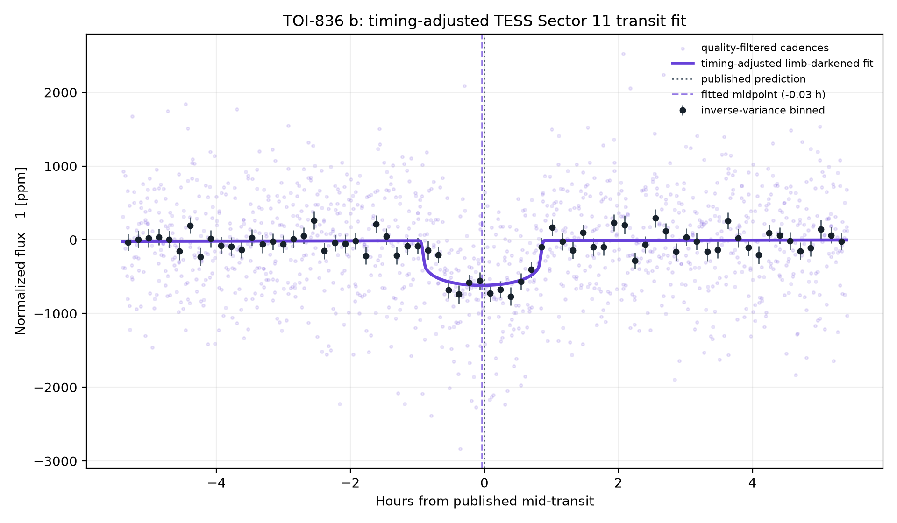
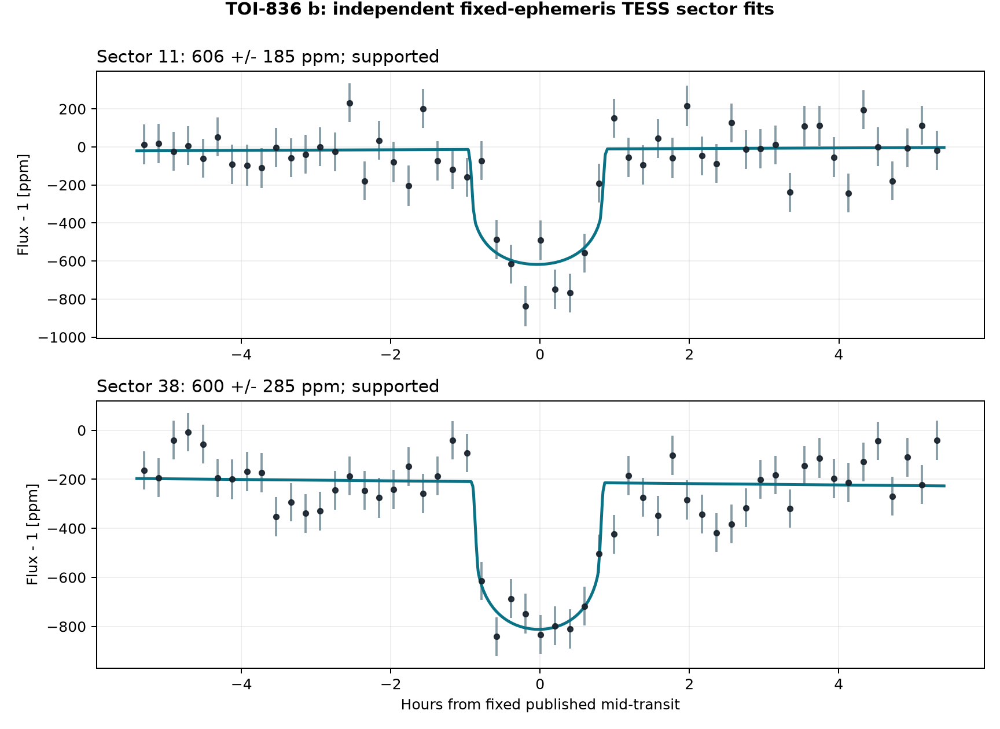
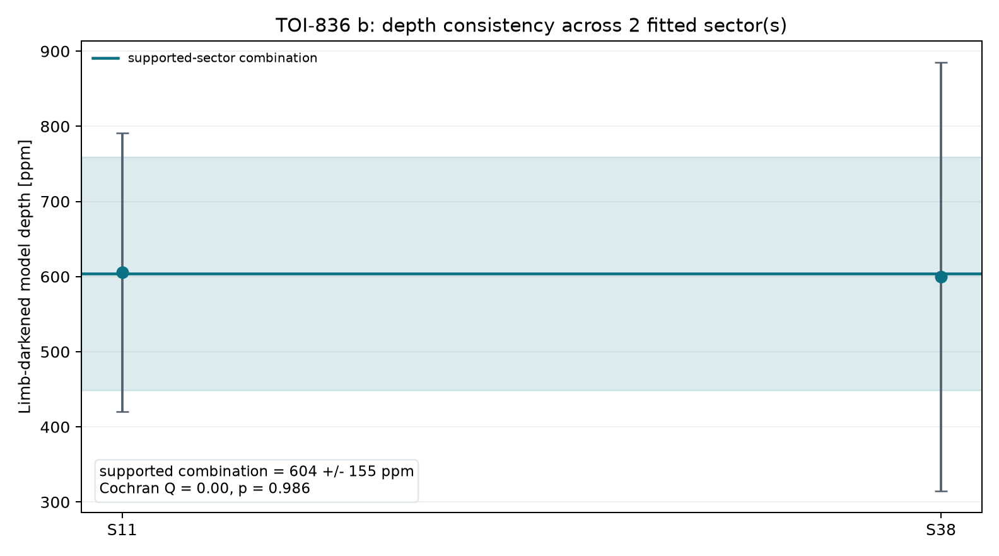
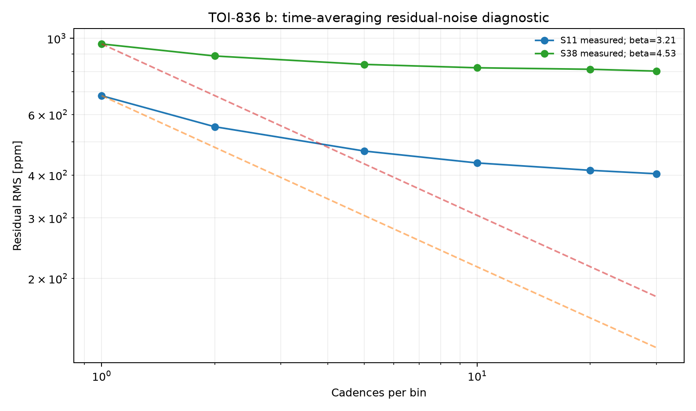
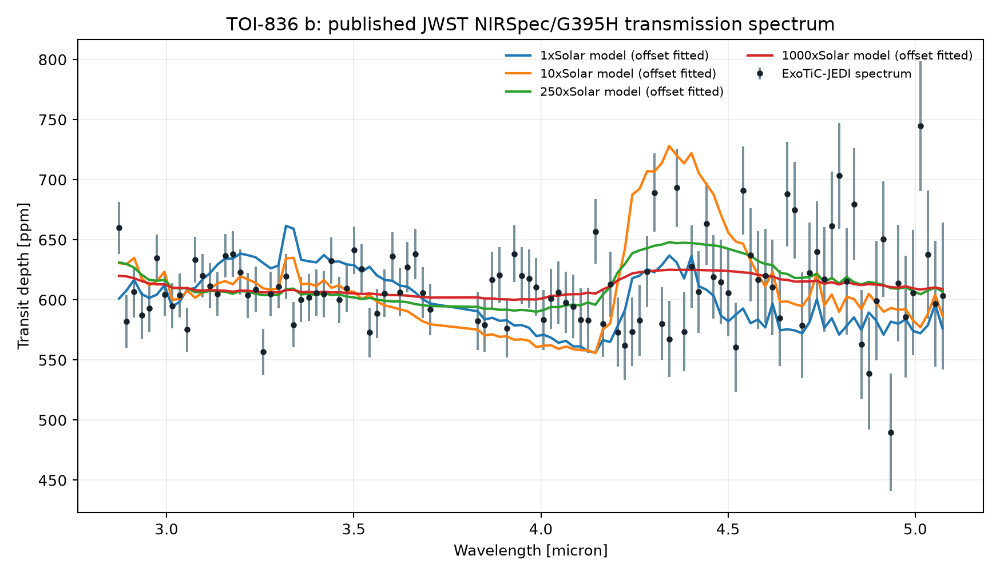

# TOI-836 b — Real TESS Transit Report

<p align="center">
  
</p>

One real public TESS SPOC light curve; one historical NASA Exoplanet Archive ephemeris; one timing-adjusted, limb-darkened transit fit.

**[Open the full report](https://biswajit1999.github.io/toi-836b-exoplanet-report/)** — the live GitHub Pages version.

## Data sources

- **System parameters** — the saved `pscomppars` row from the [NASA Exoplanet Archive TAP service](https://exoplanetarchive.ipac.caltech.edu/TAP/sync?query=select+pl_name%2Chostname%2Cra%2Cdec%2Cpl_orbper%2Cpl_tranmid%2Cpl_trandur%2Cpl_rade%2Cpl_bmasse%2Cpl_eqt%2Cpl_orbsmax%2Csy_dist%2Csy_tmag%2Cst_teff%2Cst_rad%2Cst_mass%2Cdisc_year%2Cdiscoverymethod%2Cdisc_refname%2Cdisc_pubdate%2Cdisc_facility+from+pscomppars+where+pl_name%3D%27TOI-836+b%27&format=csv).
- **Observed photometry** — unmodified MAST file `tess2019112060037-s0011-0000000440887364-0143-s_lc.fits`, TESS Sector 11, DOI [10.17909/t9-nmc8-f686](https://doi.org/10.17909/t9-nmc8-f686). This is a real SPOC reduced light curve, not simulated data.
- Exact URLs, IDs, retrieval date, and SHA-256 checksum are in [`data/SOURCE.md`](data/SOURCE.md).

## Reproduce the analysis

```bash
pip install -r requirements.txt
python scripts/analyze_transit.py
python scripts/analyze_multisector.py
python scripts/analyze_spectrum.py
pytest tests/ -v
```

The script keeps finite `QUALITY == 0` cadences, normalizes `PDCSAP_FLUX`, and applies one symmetric robust outlier rule. A local linear null is compared with a circular quadratic-limb-darkened transit. The archive period and predicted phase are retained, while midpoint, radius ratio, impact parameter, baseline, and baseline slope are fitted inside a bounded window. The limb-darkening coefficients and scaled semi-major axis are fixed and disclosed in the CSV.

## What the corrected fit shows

| Quantity | Result |
|---|---:|
| TESS sector | 11 |
| Cadences in fitted window | 1296 |
| Transit support | ΔBIC ≥ 10 |
| Midpoint correction | -0.035 h ± 1.86 min |
| Model mid-transit depth | 605.9 ± 57.8 ppm |
| Radius ratio Rp/Rs | 0.02332 |
| Fitted / published duration | 1.827 / 1.805 h |
| Linear null χ² / dof / BIC | 2615.94 / 1294 / 2630.27 |
| Transit χ² / dof / BIC | 2405.21 / 1291 / 2441.04 |
| ΔBIC (null − transit) | 189.23 |

The timing-adjusted transit is strongly preferred by ΔBIC = 189.2. Its fitted midpoint is -0.035 hours from the historical prediction; the model's mid-transit depth is 605.9 ± 57.8 ppm. A fitted timing correction can diagnose ephemeris drift, but this single-sector fit is not a replacement for a global transit-timing analysis.

<!-- MULTISECTOR-UPGRADE-START -->
## Multi-sector robustness and correlated noise

The archive prediction was timing-adjusted independently in 2 fitted sector(s) (S11, S38), of which 2 meet Delta BIC >= 10. Formal depth errors were inflated by sqrt(max(reduced chi-square, 1)) times the residual time-averaging beta factor (observed range 3.21-4.53). The robust inverse-variance model depth across supported sectors is 604.1 +/- 155.4 ppm; Cochran Q = 0.00 for 1 dof (p = 0.9857). These scaled errors address underestimated scatter and short-timescale correlation, but they are not a full Gaussian-process or physical limb-darkened transit fit.

<p align="center"></p>

<p align="center"></p>

<p align="center"></p>

The per-sector table is in [`figures/multisector_statistics.csv`](figures/multisector_statistics.csv). Regenerate all three figures with `python scripts/analyze_multisector.py`.
<!-- MULTISECTOR-UPGRADE-END -->

<!-- SPECTRUM-UPGRADE-START -->
## Published planetary spectrum

<p align="center"></p>

Across 106 bins, a weighted-flat spectrum gives chi-square/dof = 128.4/105 (p = 0.0599). At a 5% threshold this simple test does not reject flatness. Four published metallicity-grid spectra are also compared with one fitted vertical offset; these goodness-of-fit checks do not constitute a metallicity retrieval.

Source: [10.5281/zenodo.10658637](https://zenodo.org/records/10658637) (JWST NIRSpec/G395H). Exact files and checksums are in [`data/SOURCE.md`](data/SOURCE.md); complete numerical results are in [`figures/spectrum_statistics.csv`](figures/spectrum_statistics.csv).
<!-- SPECTRUM-UPGRADE-END -->

## System context

- Radius: 1.70 Earth radii
- Mass: 4.53 Earth masses
- Orbital period: 3.816730 days
- Transit duration: 1.805 hours
- Semi-major axis: 0.0422 AU
- Equilibrium temperature: 871 K
- Host: TOI-836 · distance 27.50 pc
- Discovery: 2023 by Transit (Transiting Exoplanet Survey Satellite (TESS))

## Limitations

- The orbit is assumed circular and the quadratic limb-darkening coefficients are fixed representative values; they are not atmosphere-grid interpolations.
- The scaled semi-major axis is derived from the saved composite semi-major axis and stellar radius; their uncertainties are not propagated.
- Midpoint freedom corrects accumulated ephemeris error but introduces a bounded timing search. ΔBIC, not a naïve one-parameter p-value, is used as the support gate.
- PDCSAP processing, dilution, stellar variability, transit-timing variations, and long-timescale covariance can still bias the inferred geometry.
- Radius ratio, impact parameter, and fixed limb darkening are correlated. Published global fits with physical priors and simultaneous detrending remain authoritative.

## Repository structure

```text
README.md
index.html
requirements.txt
data/                       unmodified TESS FITS + NASA row + SOURCE.md
scripts/analyze_transit.py  timing-adjusted limb-darkened transit fit
figures/                    generated plot + summary_statistics.csv
tests/                      real-data regression tests
.github/workflows/tests.yml CI on every push and pull request
LICENSE                     MIT
```

## References

1. [Hawthorn et al. 2023](https://ui.adsabs.harvard.edu/abs/2023MNRAS.520.3649H/abstract) — discovery reference as listed by the NASA Exoplanet Archive.
2. Ricker, G. R. et al. (2015), *Transiting Exoplanet Survey Satellite (TESS)*, JATIS 1, 014003, [doi:10.1117/1.JATIS.1.1.014003](https://doi.org/10.1117/1.JATIS.1.1.014003).
3. TESS Team, *TESS Light Curves — All Sectors*, MAST, [doi:10.17909/t9-nmc8-f686](https://doi.org/10.17909/t9-nmc8-f686); Sector 11 used here.
4. [NASA Exoplanet Archive](https://exoplanetarchive.ipac.caltech.edu/), `pscomppars` TAP row retrieved 2026-08-15.

## Author

Biswajit Jana — [Portfolio](https://biswajit1999.github.io/Biswajit_Jana.github.io/) · [GitHub](https://github.com/Biswajit1999) · [LinkedIn](https://www.linkedin.com/in/biswajit-jana-27011a151/) · [ORCID](https://orcid.org/0009-0002-2411-1891)
