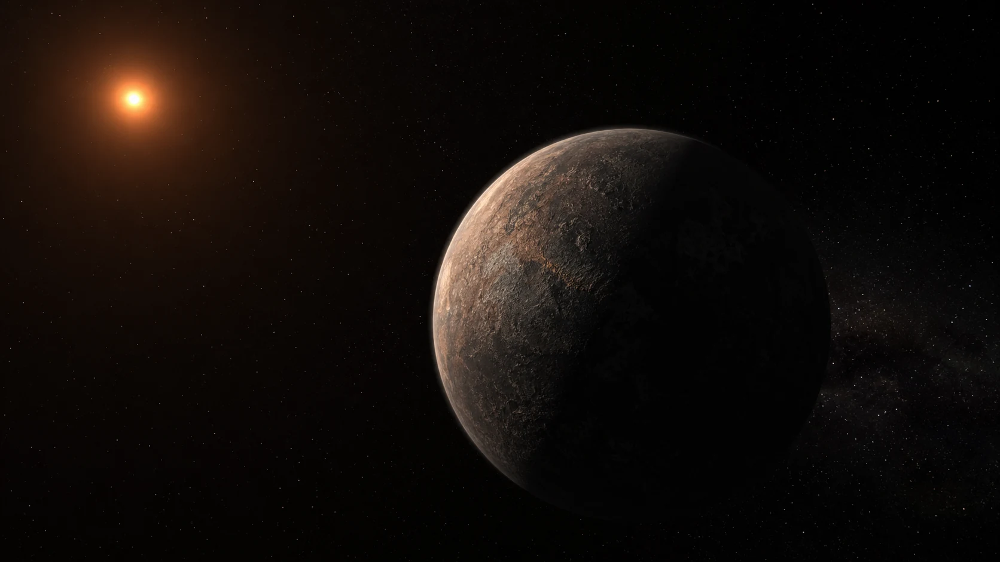
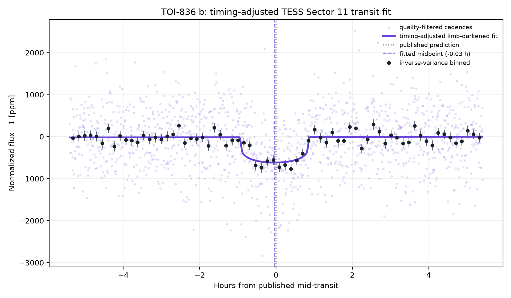
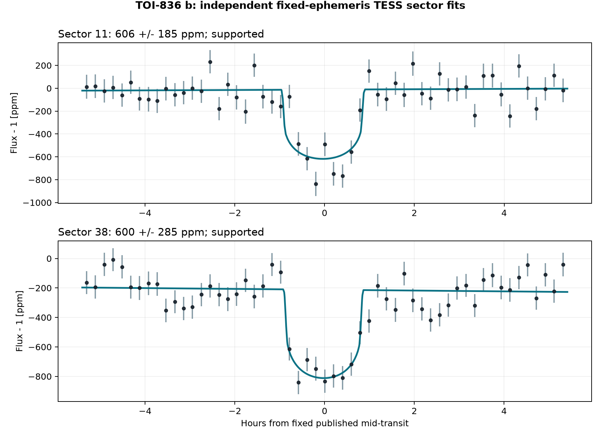
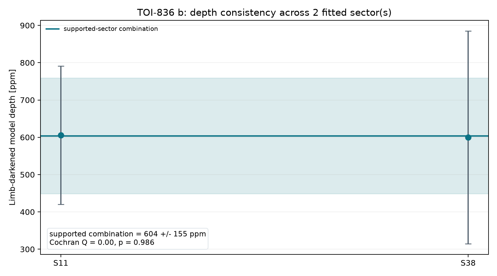
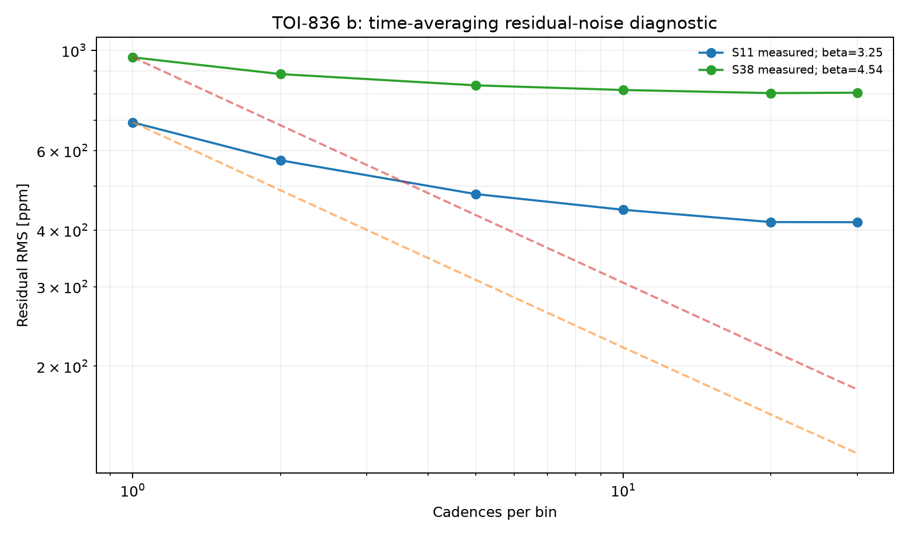
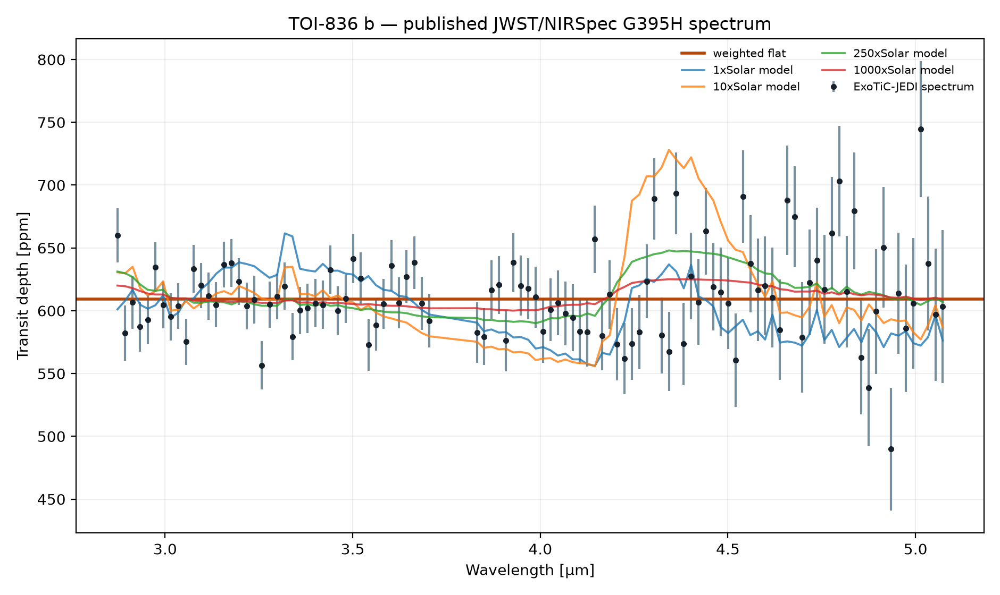
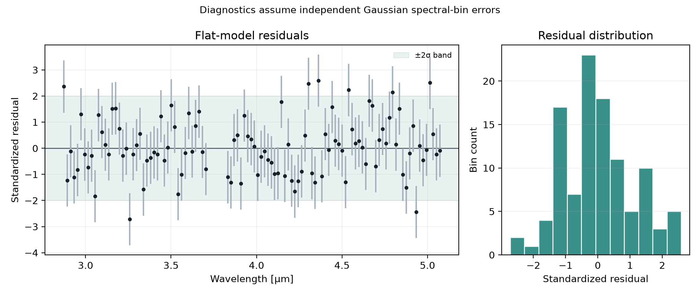
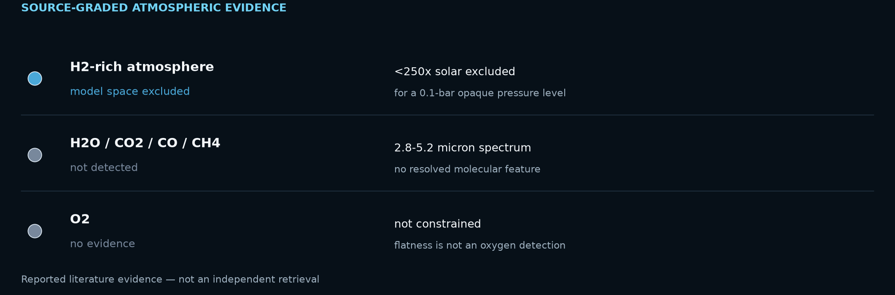

# TOI-836 b: What a Flat JWST Spectrum Can Rule Out
<!-- RESEARCH-IDENTITY-START -->
**Independent research report by [Biswajit Jana](https://biswajit1999.github.io/Biswajit_Jana.github.io/)** · [Live report](https://biswajit1999.github.io/toi-836b-exoplanet-report/) · [ORCID](https://orcid.org/0009-0002-2411-1891) · [Complete research portfolio](https://biswajit1999.github.io/Biswajit_Jana.github.io/research/exoplanets/)
<!-- RESEARCH-IDENTITY-END -->


<!-- TARGET-IDENTITY-START -->
<p align="center">
  
</p>

<p align="center"><em>AI-generated artist's interpretation informed by the measured system properties; not a direct image.</em></p>

**Rocky super-Earth · flat transmission spectrum · JWST + TESS**

A 1.7-Earth-radius planet whose precise JWST spectrum shows no resolved molecular features, yet excludes a clear low-metallicity hydrogen-dominated atmosphere.
<!-- TARGET-IDENTITY-END -->
<p align="center">
  
</p>


**[Open the full report](https://biswajit1999.github.io/toi-836b-exoplanet-report/)** — the live GitHub Pages version.

## Data sources

- **System parameters** — the saved `pscomppars` row from the [NASA Exoplanet Archive TAP service](https://exoplanetarchive.ipac.caltech.edu/TAP/sync?query=select+pl_name%2Chostname%2Cra%2Cdec%2Cpl_orbper%2Cpl_tranmid%2Cpl_trandur%2Cpl_rade%2Cpl_bmasse%2Cpl_eqt%2Cpl_orbsmax%2Csy_dist%2Csy_tmag%2Cst_teff%2Cst_rad%2Cst_mass%2Cdisc_year%2Cdiscoverymethod%2Cdisc_refname%2Cdisc_pubdate%2Cdisc_facility+from+pscomppars+where+pl_name%3D%27TOI-836+b%27&format=csv).
- **Observed photometry** — unmodified MAST file `tess2019112060037-s0011-0000000440887364-0143-s_lc.fits`, TESS Sector 11, DOI [10.17909/t9-nmc8-f686](https://doi.org/10.17909/t9-nmc8-f686). This is a real SPOC reduced light curve, not simulated data.
- Exact URLs, IDs, retrieval date, and SHA-256 checksum are in [`data/SOURCE.md`](data/SOURCE.md).

## Reproduce the analysis

```bash
pip install -r requirements.txt
python scripts/analyze_transit.py
python scripts/analyze_multisector.py
python scripts/analyze_spectrum.py
python scripts/analyze_atmospheric_evidence.py
pytest tests/ -v
```

The script keeps finite `QUALITY == 0` cadences, normalizes `PDCSAP_FLUX`, and applies one symmetric robust outlier rule. A local linear null is compared with a circular quadratic-limb-darkened transit. The archive period and predicted phase are retained, while midpoint, radius ratio, impact parameter, baseline, and baseline slope are fitted inside a bounded window. The limb-darkening coefficients and scaled semi-major axis are fixed and disclosed in the CSV.

## What the corrected fit shows

| Quantity | Result |
|---|---:|
| TESS sector | 11 |
| Cadences in fitted window | 1296 |
| Transit support | ΔBIC ≥ 10 |
| Midpoint correction | -0.035 h ± 1.86 min |
| Model mid-transit depth | 605.9 ± 57.8 ppm |
| Radius ratio Rp/Rs | 0.02332 |
| Fitted / published duration | 1.827 / 1.805 h |
| Linear null χ² / dof / BIC | 2615.94 / 1294 / 2630.27 |
| Transit χ² / dof / BIC | 2405.21 / 1291 / 2441.04 |
| ΔBIC (null − transit) | 189.23 |

The timing-adjusted transit is strongly preferred by ΔBIC = 189.2. Its fitted midpoint is -0.035 hours from the historical prediction; the model's mid-transit depth is 605.9 ± 57.8 ppm. A fitted timing correction can diagnose ephemeris drift, but this single-sector fit is not a replacement for a global transit-timing analysis.

## Multi-sector robustness and correlated noise

The archive prediction was timing-adjusted independently in 2 fitted sector(s) (S11, S38), of which 2 meet Delta BIC >= 10. Formal depth errors were inflated by sqrt(max(reduced chi-square, 1)) times the residual time-averaging beta factor (observed range 3.21-4.53). The robust inverse-variance model depth across supported sectors is 604.1 +/- 155.4 ppm; Cochran Q = 0.00 for 1 dof (p = 0.9857). These scaled errors address underestimated scatter and short-timescale correlation, but they are not a full Gaussian-process or physical limb-darkened transit fit.

<p align="center"></p>

<p align="center"></p>

<p align="center"></p>

The per-sector table is in [`figures/multisector_statistics.csv`](figures/multisector_statistics.csv). Regenerate all three figures with `python scripts/analyze_multisector.py`.
## Published planetary spectrum

<p align="center"></p>

Across 106 bins, a weighted-flat spectrum gives chi-square/dof = 128.4/105
(p = 0.0599). Under the declared independent-Gaussian-bin assumption, this
test does not reject flatness at 5%; it does not prove that the spectrum is
exactly flat. In 106 leave-one-bin-out reruns, p ranges from 0.0524 to 0.1228,
and a likelihood fit gives 8.0 ppm of additional independent scatter. The
largest standardized flat-model residual is 2.72.

Four archived metallicity-grid spectra are compared after fitting one vertical
offset. Their source-provided rejection metadata (7.5, 8.2, 3.0, and 1.7 sigma
for 1x, 10x, 250x, and 1000x solar) are retained separately from this
repository's goodness-of-fit calculations. Neither calculation is an
atmospheric retrieval.

Source: [10.5281/zenodo.10658637](https://zenodo.org/records/10658637) (JWST NIRSpec/G395H). Exact files and checksums are in [`data/SOURCE.md`](data/SOURCE.md); complete numerical results are in [`figures/spectrum_statistics.csv`](figures/spectrum_statistics.csv).

<p align="center"></p>

The full estimand and assumption boundary is documented in
[`docs/METHODS.md`](docs/METHODS.md), with numerical checks in
[`docs/VALIDATION.md`](docs/VALIDATION.md) and claim limits in
[`docs/LIMITATIONS.md`](docs/LIMITATIONS.md).

<!-- ATMOSPHERE-EVIDENCE-START -->
## Atmospheric evidence: detection, limit, or unknown?

<p align="center"></p>

This is an informative non-detection. The public spectrum is not rejected by
the declared flat-line test, so it does not identify H2O, CO2, CO, CH4, or O2.
The source paper excludes its tested clear-atmosphere models below 250 times
solar metallicity and mean molecular weight below about 6 g/mol under a
0.1-bar opaque-pressure assumption. Those are conditional model-grid limits,
not a prior-independent composition measurement.

| Species | Status | Evidence | Basis |
|---|---|---|---|
| H2-rich atmosphere | model space excluded | <250x solar excluded | for a 0.1-bar opaque pressure level |
| H2O / CO2 / CO / CH4 | not detected | flat 2.8-5.2 micron spectrum | no resolved molecular feature |
| O2 | no evidence | not constrained | flat spectrum is not an oxygen detection |

Primary source: [Alderson et al. 2024, JWST COMPASS](https://doi.org/10.3847/1538-3881/ad32c9). The table is also available as [`data/atmospheric_evidence.csv`](data/atmospheric_evidence.csv). Oxygen-bearing species such as H2O, CO2, and SO2 are **not** evidence for molecular oxygen (O2) or a biosignature.
<!-- ATMOSPHERE-EVIDENCE-END -->

## System context

- Radius: 1.70 Earth radii
- Mass: 4.53 Earth masses
- Orbital period: 3.816730 days
- Transit duration: 1.805 hours
- Semi-major axis: 0.0422 AU
- Equilibrium temperature: 871 K
- Host: TOI-836 · distance 27.50 pc
- Discovery: 2023 by Transit (Transiting Exoplanet Survey Satellite (TESS))

## Limitations

- The orbit is assumed circular and the quadratic limb-darkening coefficients are fixed representative values; they are not atmosphere-grid interpolations.
- The scaled semi-major axis is derived from the saved composite semi-major axis and stellar radius; their uncertainties are not propagated.
- Midpoint freedom corrects accumulated ephemeris error but introduces a bounded timing search. ΔBIC, not a naïve one-parameter p-value, is used as the support gate.
- PDCSAP processing, dilution, stellar variability, transit-timing variations, and long-timescale covariance can still bias the inferred geometry.
- Radius ratio, impact parameter, and fixed limb darkening are correlated. Published global fits with physical priors and simultaneous detrending remain authoritative.
- The archived spectrum provides marginal errors but no wavelength covariance matrix; spectral p-values therefore assume independent Gaussian bins.
- A non-rejected flat model does not prove the absence of an atmosphere, and the metallicity exclusions apply only to the source paper's tested clear-atmosphere grid and pressure boundary.

## Repository structure

```text
README.md
index.html
requirements.txt
data/                       unmodified TESS FITS + NASA row + SOURCE.md
scripts/analyze_transit.py  timing-adjusted limb-darkened transit fit
figures/                    generated plot + summary_statistics.csv
tests/                      real-data regression tests
.github/workflows/tests.yml CI on every push and pull request
LICENSE                     MIT
```

## References

1. [Hawthorn et al. 2023](https://ui.adsabs.harvard.edu/abs/2023MNRAS.520.3649H/abstract) — discovery reference as listed by the NASA Exoplanet Archive.
2. Ricker, G. R. et al. (2015), *Transiting Exoplanet Survey Satellite (TESS)*, JATIS 1, 014003, [doi:10.1117/1.JATIS.1.1.014003](https://doi.org/10.1117/1.JATIS.1.1.014003).
3. TESS Team, *TESS Light Curves — All Sectors*, MAST, [doi:10.17909/t9-nmc8-f686](https://doi.org/10.17909/t9-nmc8-f686); Sector 11 used here.
4. [NASA Exoplanet Archive](https://exoplanetarchive.ipac.caltech.edu/), `pscomppars` TAP row retrieved 2026-08-15.
5. Alderson, L. et al. (2024), *The Astronomical Journal* 167, 216, [doi:10.3847/1538-3881/ad32c9](https://doi.org/10.3847/1538-3881/ad32c9).

## Author

Biswajit Jana — [Portfolio](https://biswajit1999.github.io/Biswajit_Jana.github.io/) · [GitHub](https://github.com/Biswajit1999) · [LinkedIn](https://www.linkedin.com/in/biswajit-jana-27011a151/) · [ORCID](https://orcid.org/0009-0002-2411-1891)
